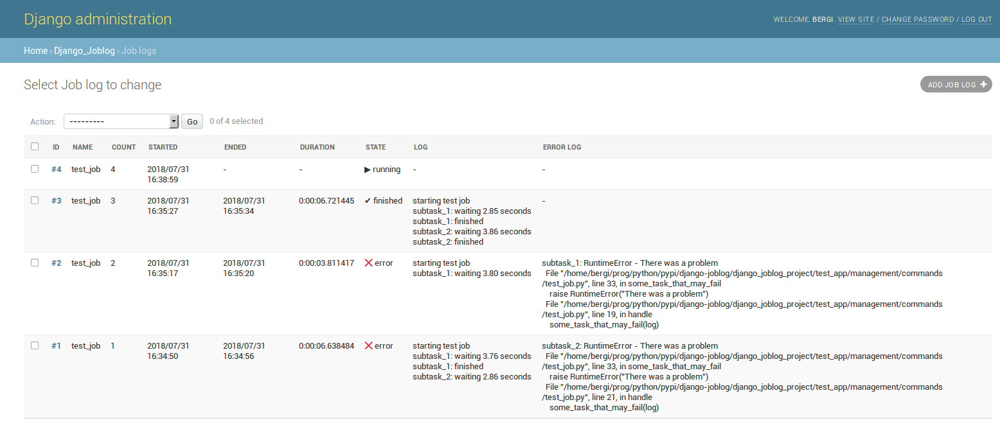

# django-joblog v0.2.2

A generic django-utility that helps to log stuff to the database.

- [Installation](#installation)
- [Usage](#usage)
    - [Parallelism](#parallelism)
    - [Context](#context)
    - [DummyJobLogger](#dummyjoblogger)
    - [Using the Model](#using-the-model)
- [Configuration](#configuration)
    - [DB alias](#db-alias)
    - [Live updates](#live-updates)
    - [Ping mode](#ping)
- [Testing](#testing)
    - [This repo](#the-repository)


# Overview

```python
from django_joblog import JobLogger

with JobLogger("task-name") as log:
    log.log("task started")
    if 1 != 2:
        log.error("The impossible happened!") 
```

The following information is stored to the database for further inspection:
- the task's name
- the count of invocation for the specific task
- start-time
- end-time
- duration 
- any log or error output 
- the exception trace, for exception occuring inside the `with`-block

This can be useful in conjuction with cronjobs and asynchronous tasks with, e.g., these libraries:
[django-kronos](https://github.com/jgorset/django-kronos), 
[django-rq](https://github.com/rq/django-rq), ...


# Installation

```bash
pip install django-joblog
```

Then add `django_joblog` to `INSTALLED_APPS` in your django `settings.py` and call `manage.py migrate`.

## Requirements

- [Python](https://www.python.org) 2 or 3
- [Django](https://www.djangoproject.com) >= 1.10


# Usage 

### Parallelism

By default, jobs are not allowed to run in parallel. This can be changed with `parallel=True` in 
the `JobLogger` constructor. 

**If you start a JobLogger while a job with the same name is already
running, a `django_joblog.JobIsAlreadyRunningError` is raised.** Additionally, a job log entry
in the database will be created with `blocked` state.

For example, you might have a cronjob that runs every minute and looks for open tasks in the 
database. If you wrap the task in a `JobLogger` you can be sure, that the tasks are not 
worked on in parallel:

```python
from django_joblog import JobLogger, JobIsAlreadyRunningError

def cronjob_open_task_worker():
    if open_tasks():
        with JobLogger("work-open-tasks") as log:
            work_open_tasks(log)
            
# to avoid the error message on multiple invocation:
def cronjob_open_task_worker():
    if open_tasks():
        try:
            with JobLogger("work-open-tasks") as log:
                work_open_tasks(log)
        except JobIsAlreadyRunningError:
            pass
```

### Context

To change the logging-context within a job, use `JobLoggerContext`. 
It might help to spot at which point an output is generated or an exception is thrown.

```python
from django_joblog import JobLogger, JobLoggerContext

with JobLogger("pull-the-api") as log:
    
    credentials = get_credentials()
    log.log("using user %s" % credentials.name)
    
    with JobLoggerContext(log, "api"):
        api = Api(credentials)
        log.log("connected")
        
        with JobLoggerContext(log, "submit"):
            api.submit(data)
            log.log("%s items submitted" % len(data))
            
        with JobLoggerContext(log, "check result"):
            log.log(api.check_result())
```            

The log output in database will look like this:
```
using user Herbert
api: connected
api:submit: 42 items submitted
api:check result: 23 items updated
```

An exception caught by the error log might look like this:
```
api:submit: IOError - Status code 404 returned for url https://my.api.com/submit
 File "/home/user/python/awesome_project/api/Api.py, line 178, in Api._make_request
   self.session.post(url, data=params)
 File "/home/user/python/awesome_project/api/Api.py, line 66, in Api.submit
   self._make_request(url, params)
 File "/home/user/python/awesome_project/main.py, line 12
   api.submit(data) 
```

As can be seen, a `JobLoggerContext` does not pop it's name from the context stack 
in case of an exception! Which means, catching exceptions within higher context levels 
than where those exceptions where raised does not leave a valid context stack if 
you resume work after the caught exception.    


### DummyJobLogger

You can use the `DummyJobLogger` class to provide logging without storing stuff to the database. 
This might be useful for debugging purposes, or if you run a function as a `manage.py`-task but
need database logging only for cronjobs.

In general, functions can be designed to work with a `JobLogger` but do not *require* it.

```python
from django_joblog import JobLogger, DummyJobLogger

def buy_eggs(log=None):
    log = log or DummyJobLogger()
    
    log.log("Gonna buy some eggs!")
    ...

def cronjob_invokation():
    with JobLogger("buy-eggs") as log:
        buy_eggs(log)
        
def debug_invokation():
    buy_eggs()

```

### Using the model

By default, there is a django admin view for the `JobLogModel`. 
You can find the model, as usual, in `django_joblog.models`. 
Please check the file [django_joblog/models.py](https://github.com/defgsus/django-joblog/blob/master/django_joblog/models.py)
for the specific fields. It's nothing special.




# Configuration

The `django_joblog` app can be configured with an object in your django project `settings.py`, 
for example:

```python
JOBLOG_CONFIG = {
    # name of alternate database connection, to circumvent transactions on default connection
    "db_alias": "joblog",
    # enable .log and .error to write to database immediately
    "live_updates": True,
    # enable a constant update of job state - to check for jobs which went away without notice
    "ping": True,
    "ping_interval": 1,
    # always print to console during jobs
    "print_to_console": True
}
```

The whole object and all of it's fields are optional. 

### db_alias

`db_alias` defines an alternative name for the database connection. 
This name must be present in the `DATABASE` setting. 

One does not normally need to define this setting unless you want to make sure that 
[Live updates](#live-updates) or using the [Ping mode](#ping) always work even when transactions
are used inside the job body. Consider this example:

```python
from django.db import transaction
from django_joblog import JobLogger

with JobLogger("my-job") as job:
    job.log("Outside transaction")
    with transaction.atomic():
        job.log("Inside transaction")
        # ...other stuff...
```   

If you are using [Live updates](#live-updates) and need to make sure that the second log 
("Inside transaction") is immediately stored to the database you need to define a second 
database connection. It can just be a copy of the `'default'` database setting.    

### live updates

Setting `live_updates` to `True` will store the current log and error texts as long with the current
job duration to database whenever `JobLogger.log()` or `JobLogger.error()` are called.

### ping

Setting `ping` to `True` will spawn a separate thread when calling `with JobLogger(...)` that will 
constantly update the joblog database with the current log text, error text and duration. 
The update-interval is configured with `ping_interval` in seconds. 

Normally, if a job exits unexpectedly (segfault, power-off, restart of vm, etc..) it's state in 
the database will stay `running` forever. 
New jobs with the same name will be blocked from execution.

However, enabling `ping` mode will make sure, that if a job (in database) who's `duration` is 
yet undefined or larger than the `ping_interval` can be considered stopped.  

To set those dangling job's database state to `vanished` use: 
```bash
./manage.py joblog_cleanup
```
or 
```python
from django_joblog.models import JobLogModel
JobLogModel.cleanup()
```


# Testing

Unit-tests are [Django-style](https://docs.djangoproject.com/en/2.0/topics/testing/overview/#running-tests) 
and are placed in [django_joblog/tests/](https://github.com/defgsus/django-joblog/blob/master/django_joblog/tests/).

Note that the *parallel* tests will fail with the **Sqlite** backend, because of database-locking.

## The repository

[The repo](https://github.com/defgsus/django-joblog) contains a whole django project (`django_joblog_project`) 
for ease of development. `setup.py` only exports the `django_joblog` app. 

The default database backend is configured to **MySQL**.

To start the runserver or run the tests within the repo, open mysql console:

```mysql
CREATE USER 'django_logs_user'@'localhost' IDENTIFIED BY 'django_logs_pwd';

CREATE DATABASE django_logs_test CHARACTER SET utf8 COLLATE utf8_general_ci;

GRANT ALL ON django_logs_test.* TO 'django_logs_user'@'localhost';
GRANT ALL ON django_logs_test_test.* TO 'django_logs_user'@'localhost';
``` 

Then alternatively, depending on the python version:
```bash
pip install MySQL-python    # for python 2

pip install PyMySQL         # for python 3
pip install mysqlclient     #   or alternatively
```

And finally:
```bash
./manage.py test

# or
./manage.py migrate
./manage.py runserver
```
